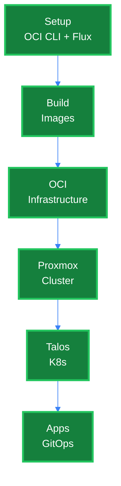
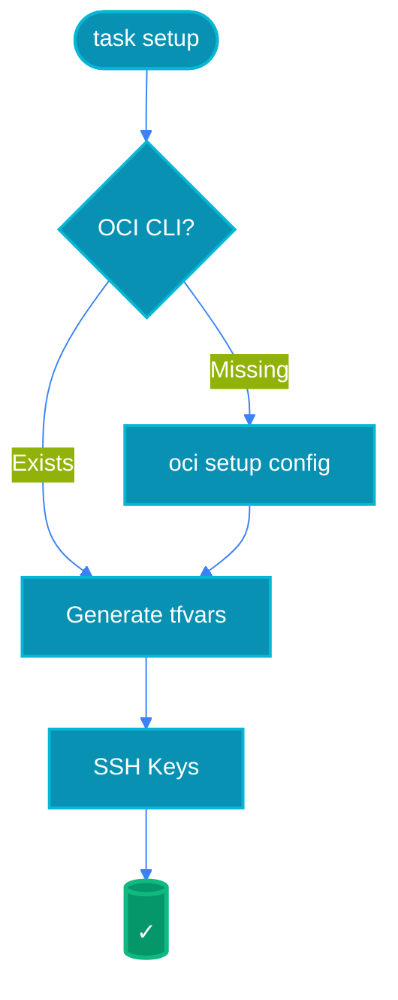
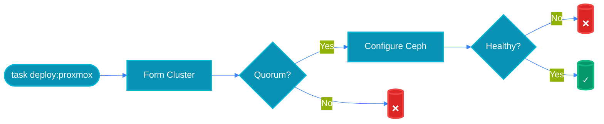
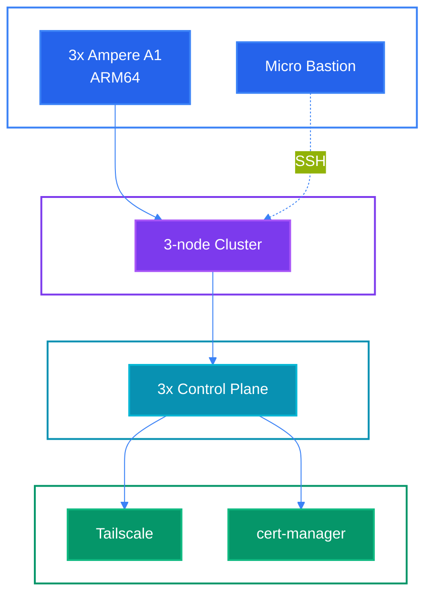
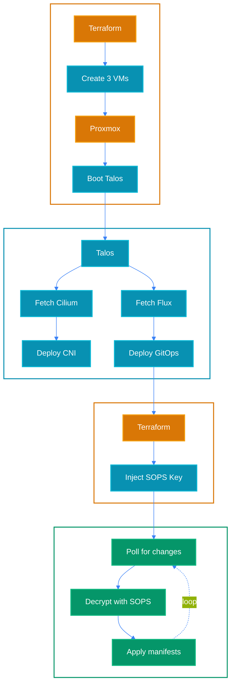
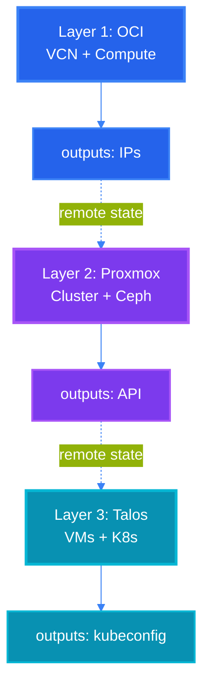
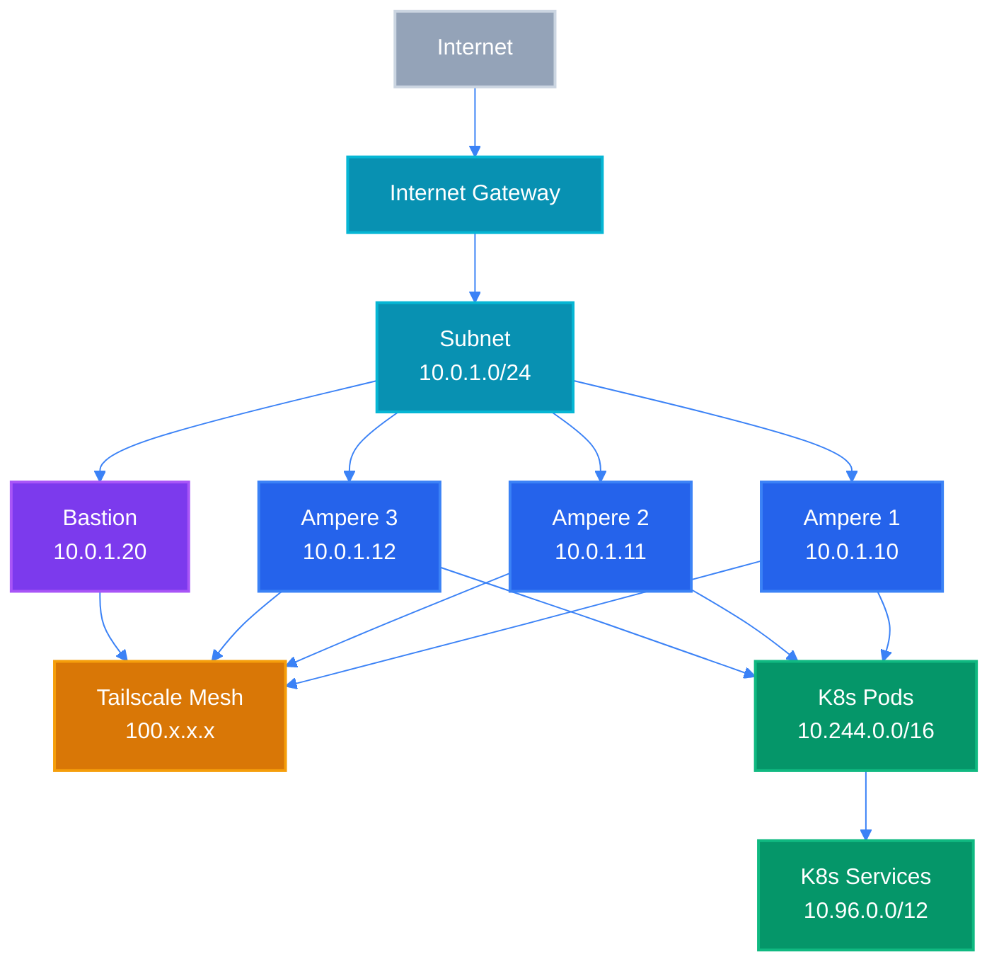
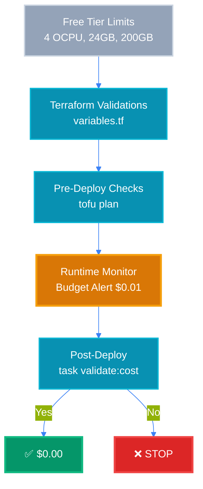

# Architecture Diagrams

Visual representations of the OCI Free Tier infrastructure. All diagrams use explicit color styling to ensure readability on both light and dark backgrounds.

## Table of Contents

### 1. [Deployment Pipeline](#deployment-pipeline)
   - [Complete Flow](#complete-flow)
   - [Phase 0: Setup](#phase-0-setup)
   - [Phase 2: OCI Infrastructure](#phase-2-oci-infrastructure)
   - [Phase 3: Proxmox Cluster](#phase-3-proxmox-cluster)

### 2. [Talos Kubernetes](#talos-kubernetes)
   - [Architecture Overview](#architecture-overview)
   - [Bootstrap Sequence](#bootstrap-sequence)

### 3. [Terraform Layers](#terraform-layers)
   - [Three-Layer Architecture](#three-layer-architecture)

### 4. [Network Architecture](#network-architecture)
   - [Physical + Logical Topology](#physical--logical-topology)

### 5. [Cost Enforcement](#cost-enforcement)
   - [Free Tier Validation Flow](#free-tier-validation-flow)

---

## Deployment Pipeline

### Complete Flow

This diagram shows the complete deployment pipeline from initial setup to running applications.

**Related files:** [`Taskfile.yml`](../Taskfile.yml), [`QUICKSTART.md`](./QUICKSTART.md)

### Phase 0: Setup

Initializes the development environment by configuring OCI CLI and setting up Flux GitOps.

**Related files:** [`scripts/setup.sh`](../scripts/setup.sh), [`scripts/setup-flux.sh`](../scripts/setup-flux.sh)

### Phase 2: OCI Infrastructure

Provisions Oracle Cloud Infrastructure resources within free tier limits.

**Related files:** [`tofu/oci/main.tf`](../tofu/oci/main.tf)

```mermaid
%%{init: {'theme':'base', 'themeVariables': { 'primaryColor':'#0891b2','primaryTextColor':'#fff','primaryBorderColor':'#06b6d4','lineColor':'#3b82f6','textColor':'#fff'}}}%%
flowchart LR
    Start(["task deploy:oci"])
    Plan["tofu plan/apply"]
    VCN["VCN + Networking"]
    Compute["3x Ampere + 1x Micro"]
    Mesh["Tailscale Mesh"]
    Done[("✓")]
    
    Start --> Plan --> VCN --> Compute --> Mesh --> Done
    
    style Start fill:#0891b2,stroke:#06b6d4,stroke-width:2px,color:#fff
    style Plan fill:#0891b2,stroke:#06b6d4,stroke-width:2px,color:#fff
    style VCN fill:#0891b2,stroke:#06b6d4,stroke-width:2px,color:#fff
    style Compute fill:#0891b2,stroke:#06b6d4,stroke-width:2px,color:#fff
    style Mesh fill:#0891b2,stroke:#06b6d4,stroke-width:2px,color:#fff
    style Done fill:#059669,stroke:#10b981,stroke-width:3px,color:#fff
```

### Phase 3: Proxmox Cluster

Forms 3-node Proxmox cluster with Ceph storage.

**Related files:** [`tofu/proxmox-cluster/main.tf`](../tofu/proxmox-cluster/main.tf)

## Talos Kubernetes

### Architecture Overview

Complete technology stack from OCI instances to Kubernetes applications.

**Related files:** [`WARP.md`](../WARP.md#architecture)

### Bootstrap Sequence

Talos K8s bootstrap timeline showing VM creation, CNI deployment, Flux installation, and GitOps reconciliation.

**Related files:** [`tofu/talos/`](../tofu/talos/), [oci-free-tier-flux repo](https://github.com/syscode-labs/oci-free-tier-flux)

## Terraform Layers

### Three-Layer Architecture

Three independent Terraform layers with clear intervention points and state dependencies.

**Related files:** [`tofu/oci/`](../tofu/oci/), [`tofu/proxmox-cluster/`](../tofu/proxmox-cluster/), [`tofu/talos/`](../tofu/talos/)

## Network Architecture

### Physical + Logical Topology

Complete network architecture showing OCI VCN, Tailscale mesh, and Kubernetes networks.

**Related files:** [`tofu/oci/main.tf`](../tofu/oci/main.tf), [`WARP.md`](../WARP.md#networking)

## Cost Enforcement

### Free Tier Validation Flow

Multi-stage validation ensuring all resources stay within free tier limits.

**Related files:** [`tofu/oci/variables.tf`](../tofu/oci/variables.tf), [`scripts/validate-cost.sh`](../scripts/validate-cost.sh)

